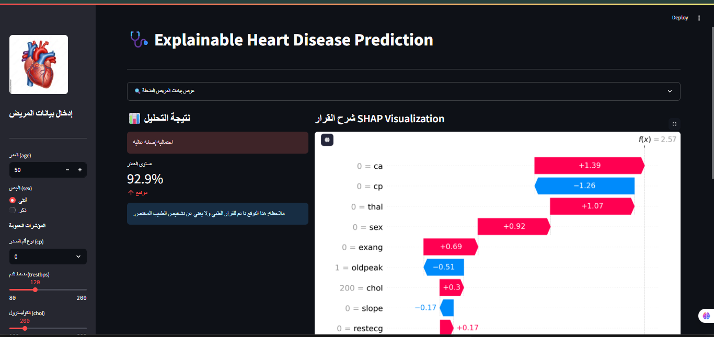
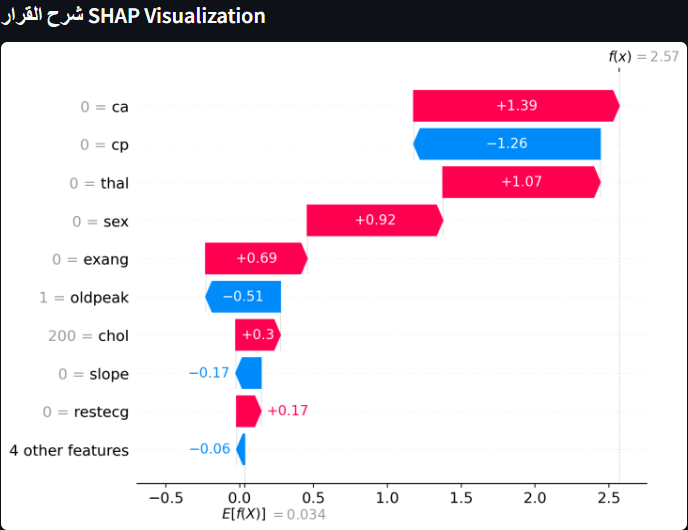

# 🩺 Explainable AI for Heart Disease Prediction

[](https://projectheartxai-ypojknjvxhajwicgxjct6m.streamlit.app)

## 📝 نبذة عن المشروع
يواجه الذكاء الاصطناعي في القطاع الصحي تحدي "الصندوق الأسود"، حيث يصعب على الأطباء الثقة في تنبؤات لا تقدم تفسيراً منطقياً. هذا المشروع يكسر هذا الحاجز عبر تقديم نظام تنبؤ عالي الدقة ومدعوم بتقنيات **الذكاء الاصطناعي القابل للتفسير (XAI)**.

## 🚀 المميزات الرئيسية
- **التنبؤ عالي الدقة:** استخدام خوارزمية **XGBoost** المتطورة والمحسنة عبر GridSearchCV.
- **الشفافية الكاملة (SHAP):** عرض رسوم بيانية توضح تأثير كل متغير حيوي (مثل ضغط الدم، الكوليسترول) على قرار النموذج.
- **تقارير طبية ذكية:** تحويل الرسوم البيانية المعقدة إلى تقرير نصي مبسط باللغة العربية يحدد عوامل الخطر والحماية.
- **توليد تقارير PDF/Print:** إمكانية توليد تقرير طبي نهائي بضغطة زر لدعم التوثيق السريري.

## 📊 المقارنة المعيارية (RF vs XGBoost)
لقد قمت بمقارنة نموذج **Random Forest** مع **XGBoost** بناءً على معايير الدقة والسرعة:
- **XGBoost:** حقق أفضل نتيجة استدعاء (Recall) بنسبة **99.29%**.
- **Random Forest:** حقق نتيجة **98.81%** مع سرعة تدريب أعلى قليلاً.
*القرار:* تم اعتماد **XGBoost** كنموذج نهائي لأن الأولوية في التشخيص الطبي هي للدقة القصوى.

## 🛠️ التقنيات المستخدمة (Tech Stack)
- **Programming:** Python 
- **Machine Learning:** XGBoost, Scikit-learn
- **Interpretability:** SHAP (Shapley Additive Explanations)
- **Web Interface:** Streamlit
- **Visualization:** Matplotlib, Seaborn

## 📂 هيكل المشروع
- `streamlit_app.py`: ملف واجهة المستخدم والمنطق البرمجي للتطبيق.
- `Explainable_Heart_Disease.ipynb`: دفتر الملاحظات الخاص بالتدريب والمقارنة.
- `model.pkl`: النموذج المدرب والمحفوظ.
- `requirements.txt`: قائمة المكتبات اللازمة لتشغيل المشروع.

## ⚙️ التشغيل المحلي
1. قم بتحميل المستودع (Clone).
2. ثبت المكتبات المطلوبة:
   ```bash
   pip install -r requirements.txt

## 📊 نتائج تحليل النماذج
نوضح هنا المقارنة بين Random Forest و XGBoost من حيث الدقة وزمن التنفيذ:


## 🖥️ واجهة التطبيق
يوفر التطبيق تجربة مستخدم سلسة للأطباء مع ميزة التفسير اللحظي:



## 🧠 التفسير باستخدام SHAP
هنا يشرح الذكاء الاصطناعي الأسباب الكامنة وراء كل تشخيص:




